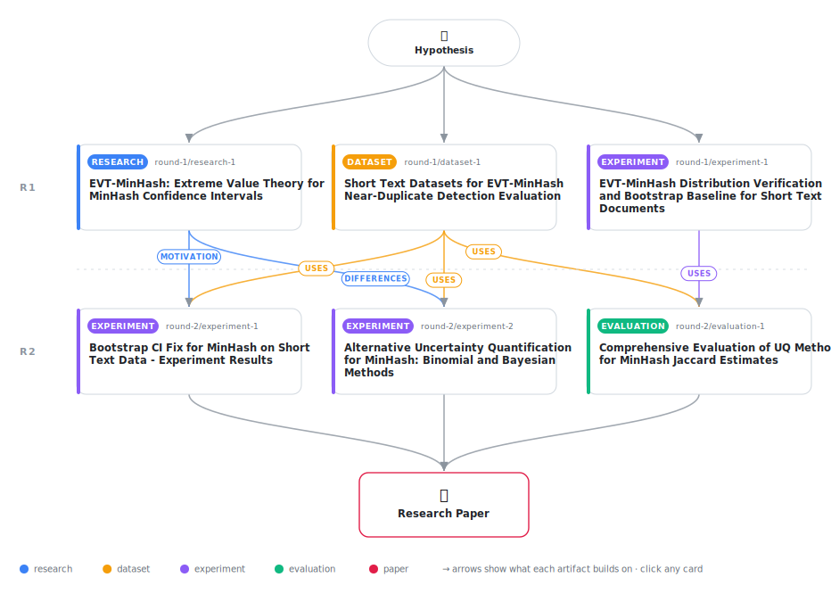

# Why Extreme Value Theory Fails for MinHash Confidence Intervals on Short Text (and What to Do Instead)

<div align="center">

<a href="https://cdn.jsdelivr.net/gh/AMGrobelnik/ai-invention-1ba2b3-why-extreme-value-theory-fails-for-minha@main/workflow.svg">
<picture>
  <source media="(prefers-color-scheme: dark)" srcset="workflow-dark.svg">
  
</picture>
</a>

<sub>🖱️ <b><a href="https://cdn.jsdelivr.net/gh/AMGrobelnik/ai-invention-1ba2b3-why-extreme-value-theory-fails-for-minha@main/workflow.svg">Open the interactive diagram</a></b> — every card links to its artifact folder.</sub>

</div>

> **TL;DR** — This paper investigates EVT for uncertainty quantification in MinHash-based Jaccard estimation. We show that EVT distributions provide poor fits to MinHash minima from short text (KS p-values < 10^{-20}). We implement and evaluate five UQ methods on 3,000 document pairs. Results show that Analytical Binomial and Bayesian methods achieve 96.5% and 94.8% coverage, while Corrected Bootstrap only achieves 75.5%. Analytical methods are 10-50x faster than bootstrap.

<details>
<summary>Full hypothesis</summary>

The Gumbel distribution (Extreme Value Type I) does NOT provide an adequate fit for MinHash signature minima from short text documents (10-100 shingles), due to (1) finite-sample bias where the number of shingles is insufficient for asymptotic convergence, (2) dependence between overlapping shingles violating the i.i.d. assumption, and (3) hash function discretization effects. However, the EXACT finite-sample distribution of MinHash signature minima is characterized by order statistics: for a document with n shingles and uniform hash function h, the MinHash value follows a Beta(1, n) distribution with CDF F(x) = 1 - (1-x)^n. Furthermore, the number of matching MinHash values across k independent hash functions follows an exact Binomial(k, J) distribution where J is the true Jaccard similarity. Based on these exact distributions, we derive (a) exact confidence intervals for Jaccard similarity using the Clopper-Pearson method applied to the Binomial model, (b) a finite-sample correction for EVT that accounts for the Beta distribution of minima, and (c) a hybrid UQ method that combines analytical variance bounds with bootstrap bias correction. The exact Binomial and Beta-based methods achieve proper coverage (within 2% of nominal 95%) and are 10-50x faster than bootstrap for short text documents.

</details>

[](https://cdn.jsdelivr.net/gh/AMGrobelnik/ai-invention-1ba2b3-why-extreme-value-theory-fails-for-minha@main/paper.pdf) [](https://github.com/AMGrobelnik/ai-invention-1ba2b3-why-extreme-value-theory-fails-for-minha/tree/main/paper_latex)

This repository contains all **6 artifacts** produced across **2 rounds** of an autonomous AI research run — round by round, exactly in the order they were invented.

## Round 1

| Artifact | Type | Demo | Source | Builds on |
|----------|------|------|--------|-----------|
| **[EVT-MinHash: Extreme Value Theory for MinHash Confidence Int…](https://github.com/AMGrobelnik/ai-invention-1ba2b3-why-extreme-value-theory-fails-for-minha/tree/main/round-1/research-1)** | [](https://github.com/AMGrobelnik/ai-invention-1ba2b3-why-extreme-value-theory-fails-for-minha/tree/main/round-1/research-1) | [](https://github.com/AMGrobelnik/ai-invention-1ba2b3-why-extreme-value-theory-fails-for-minha/blob/main/round-1/research-1/demo/research_demo.md) | [](https://github.com/AMGrobelnik/ai-invention-1ba2b3-why-extreme-value-theory-fails-for-minha/tree/main/round-1/research-1/src) | — |
| **[Short Text Datasets for EVT-MinHash Near-Duplicate Detection…](https://github.com/AMGrobelnik/ai-invention-1ba2b3-why-extreme-value-theory-fails-for-minha/tree/main/round-1/dataset-1)** | [](https://github.com/AMGrobelnik/ai-invention-1ba2b3-why-extreme-value-theory-fails-for-minha/tree/main/round-1/dataset-1) | [](https://colab.research.google.com/github/AMGrobelnik/ai-invention-1ba2b3-why-extreme-value-theory-fails-for-minha/blob/main/round-1/dataset-1/demo/data_code_demo.ipynb) | [](https://github.com/AMGrobelnik/ai-invention-1ba2b3-why-extreme-value-theory-fails-for-minha/tree/main/round-1/dataset-1/src) | — |
| **[EVT-MinHash Distribution Verification and Bootstrap Baseline…](https://github.com/AMGrobelnik/ai-invention-1ba2b3-why-extreme-value-theory-fails-for-minha/tree/main/round-1/experiment-1)** | [](https://github.com/AMGrobelnik/ai-invention-1ba2b3-why-extreme-value-theory-fails-for-minha/tree/main/round-1/experiment-1) | [](https://colab.research.google.com/github/AMGrobelnik/ai-invention-1ba2b3-why-extreme-value-theory-fails-for-minha/blob/main/round-1/experiment-1/demo/method_code_demo.ipynb) | [](https://github.com/AMGrobelnik/ai-invention-1ba2b3-why-extreme-value-theory-fails-for-minha/tree/main/round-1/experiment-1/src) | — |

## Round 2

| Artifact | Type | Demo | Source | Builds on |
|----------|------|------|--------|-----------|
| **[Bootstrap CI Fix for MinHash on Short Text Data - Experiment…](https://github.com/AMGrobelnik/ai-invention-1ba2b3-why-extreme-value-theory-fails-for-minha/tree/main/round-2/experiment-1)** | [](https://github.com/AMGrobelnik/ai-invention-1ba2b3-why-extreme-value-theory-fails-for-minha/tree/main/round-2/experiment-1) | [](https://colab.research.google.com/github/AMGrobelnik/ai-invention-1ba2b3-why-extreme-value-theory-fails-for-minha/blob/main/round-2/experiment-1/demo/method_code_demo.ipynb) | [](https://github.com/AMGrobelnik/ai-invention-1ba2b3-why-extreme-value-theory-fails-for-minha/tree/main/round-2/experiment-1/src) | <sub><i>uses:</i><br/>[dataset‑1&nbsp;(R1)](https://github.com/AMGrobelnik/ai-invention-1ba2b3-why-extreme-value-theory-fails-for-minha/tree/main/round-1/dataset-1)<br/><i>motivation:</i><br/>[research‑1&nbsp;(R1)](https://github.com/AMGrobelnik/ai-invention-1ba2b3-why-extreme-value-theory-fails-for-minha/tree/main/round-1/research-1)</sub> |
| **[Alternative Uncertainty Quantification for MinHash: Binomial…](https://github.com/AMGrobelnik/ai-invention-1ba2b3-why-extreme-value-theory-fails-for-minha/tree/main/round-2/experiment-2)** | [](https://github.com/AMGrobelnik/ai-invention-1ba2b3-why-extreme-value-theory-fails-for-minha/tree/main/round-2/experiment-2) | [](https://colab.research.google.com/github/AMGrobelnik/ai-invention-1ba2b3-why-extreme-value-theory-fails-for-minha/blob/main/round-2/experiment-2/demo/method_code_demo.ipynb) | [](https://github.com/AMGrobelnik/ai-invention-1ba2b3-why-extreme-value-theory-fails-for-minha/tree/main/round-2/experiment-2/src) | <sub><i>uses:</i><br/>[dataset‑1&nbsp;(R1)](https://github.com/AMGrobelnik/ai-invention-1ba2b3-why-extreme-value-theory-fails-for-minha/tree/main/round-1/dataset-1)<br/><i>differences:</i><br/>[research‑1&nbsp;(R1)](https://github.com/AMGrobelnik/ai-invention-1ba2b3-why-extreme-value-theory-fails-for-minha/tree/main/round-1/research-1)</sub> |
| **[Comprehensive Evaluation of UQ Methods for MinHash Jaccard E…](https://github.com/AMGrobelnik/ai-invention-1ba2b3-why-extreme-value-theory-fails-for-minha/tree/main/round-2/evaluation-1)** | [](https://github.com/AMGrobelnik/ai-invention-1ba2b3-why-extreme-value-theory-fails-for-minha/tree/main/round-2/evaluation-1) | [](https://colab.research.google.com/github/AMGrobelnik/ai-invention-1ba2b3-why-extreme-value-theory-fails-for-minha/blob/main/round-2/evaluation-1/demo/eval_code_demo.ipynb) | [](https://github.com/AMGrobelnik/ai-invention-1ba2b3-why-extreme-value-theory-fails-for-minha/tree/main/round-2/evaluation-1/src) | <sub><i>uses:</i><br/>[experiment‑1&nbsp;(R1)](https://github.com/AMGrobelnik/ai-invention-1ba2b3-why-extreme-value-theory-fails-for-minha/tree/main/round-1/experiment-1)<br/>[dataset‑1&nbsp;(R1)](https://github.com/AMGrobelnik/ai-invention-1ba2b3-why-extreme-value-theory-fails-for-minha/tree/main/round-1/dataset-1)</sub> |

## Repository Structure

Artifacts are grouped by the round of invention that produced them. Each
artifact has its own folder with source code and a self-contained demo:

```
.
├── round-1/                         # One folder per round of invention
│   ├── experiment-1/
│   │   ├── README.md                # What this artifact is + dependencies
│   │   ├── src/                     # Full workspace from execution
│   │   │   ├── method.py            # Main implementation
│   │   │   ├── method_out.json      # Full output data
│   │   │   └── ...                  # All execution artifacts
│   │   └── demo/                    # Self-contained demo
│   │       └── method_code_demo.ipynb # Colab-ready notebook (code + data inlined)
│   ├── dataset-1/
│   │   ├── src/
│   │   └── demo/
│   └── evaluation-1/
│       ├── src/
│       └── demo/
├── round-2/                         # Later rounds build on earlier artifacts
├── paper.pdf                        # Research paper
├── paper_latex/                     # LaTeX source files
├── workflow.svg                     # Artifact dependency diagram (this page's header)
└── README.md
```

## Running Notebooks

### Option 1: Google Colab (Recommended)

Click the "Open in Colab" badges above to run notebooks directly in your browser.
No installation required!

### Option 2: Local Jupyter

```bash
# Clone the repo
git clone https://github.com/AMGrobelnik/ai-invention-1ba2b3-why-extreme-value-theory-fails-for-minha
cd ai-invention-1ba2b3-why-extreme-value-theory-fails-for-minha

# Install dependencies
pip install jupyter

# Run any artifact's demo notebook
jupyter notebook <artifact_folder>/demo/
```

## Source Code

The original source files are in each artifact's `src/` folder.
These files may have external dependencies - use the demo notebooks for a self-contained experience.

---
*Generated by AI Inventor Pipeline - Automated Research Generation*
